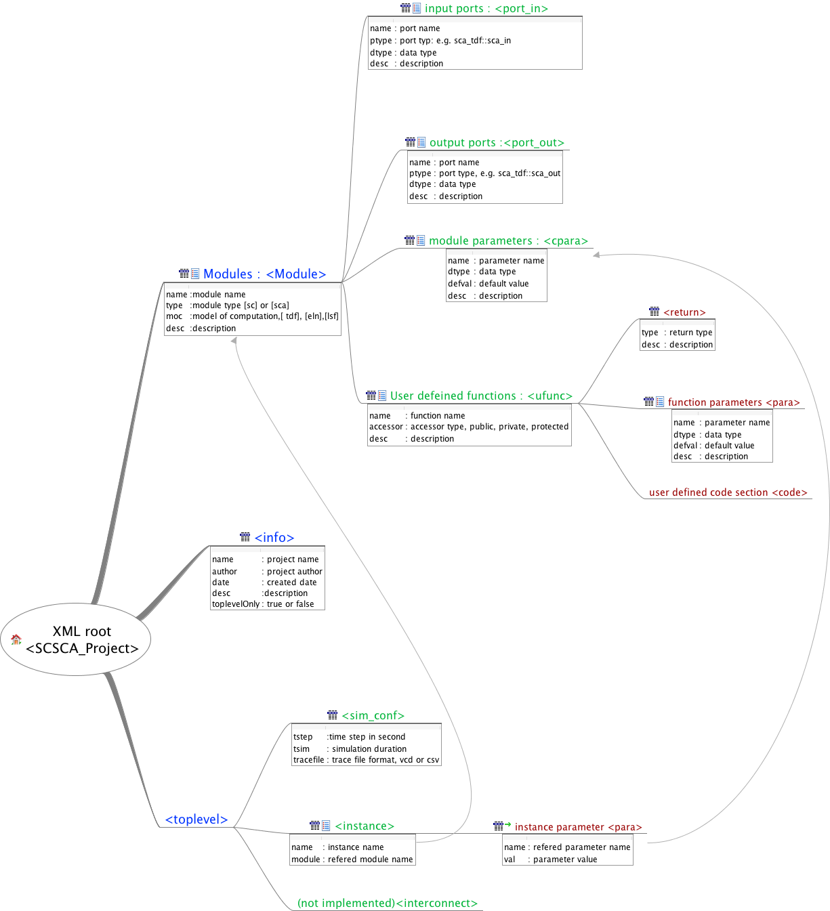

# XML to SystemC/SystemC-AMS (XML2SCA) #

This tool enables auto-generation of SystemC and SystemC-AMS codes through a XML file. The generated project includes: SC/SCA module codes(.cpp, .h), CMake files, a toplevel module (if a toplevel structure is specified), and it also  creates executable testbench for each individual module.

## Motivation ##
It was intended  to aid SystemC-AMS beginners to start up modeling and simulation quickly by avoiding manually writing testbenches and building utilities such as Makefile or Cmakes. This tool does not take IP-XACT (IEEE 1685-2014) as an input, because it puts extra effort to the beginners. Moreover IP-XACT consists too many details from a system-level perspective, most of which are often not used by non-vendor users. Instead, input of this tool has simple syntax that concentrates more on the development of module's behaviour, such as input/output ports, module parameters, etc. Beside this, XML based modeling management also has other benefits such as:

- Consistent code style in projects, workgroups
- Intuitive abstract information of modules
- Easier in module-library  management, maintenance and documentation
- Easier in module exchange, reuse, and extension
- Reduce effort in setting up projects
- Reduce effort in setting up massive configuration parameters
- Extensible  for UI design

## Features and Limitations ##
+ Simple XML rules to define SC/SCA modules
+ Auto-generation of CMake files
+ Auto-generation of executable testbench for each individual module
+ Auto-generation of JSON configuration files and automatically parse to instances
+ Support SysemC hierarchical structure
- _No support for TLM_
- _No support for toplevel interconnections_
- _ No support for template  class_


## Installation ##
0. We assume you have a UNIX style system, e.g. OSX or Linux.
1. GCC version 4.9 or higher and CMake version 2.8 or higher are required.
2. Make a directory `builddir` in the top-level directory:
```
> mkdir builddir
```
4. Go to `builddir` and build it:
```
> cd builddir
> cmake ..
> make
```

## Usage of XML2SCA ##
Application program is by default installed in the folder `XML2SCA/bin/`. Execute with argument **-f/--file** to pass project xml file or   **-h/--help** to print help information:
```
Usage:
 ./XML2SCA [OPTION...]

 -f, --file  Project XML file (default: false)
 -h, --help  Print help (default: false)
```

## Usage of Generated SC/SCA project ##

After calling the above command and if there is no error occurs, a folder with the project name specified in the XML file can been seen at the same location where the program is executed.

###  SC/SCA Project folder structure ###
SC/SCA Project folder structure diagram is showing below:
```
PROJECT_NAME
├── cmake-files             # CMake files folder
│   └── ...                 # CMake files handles the arguments to find SystemC and SystemC-AMS libraries
├── CMakeLists.txt          # Top CMake configuration file
|
├── configs                 # Configuration files folder
│   └── cfg.json            # Toplevel simulation configuration  file (json)
|
├── src                             # Source files folder
│   ├── basic                       # Files for utilitie functions incl. json and file parser
│   ├── CMakeLists                  # CMake configuration
│   ├── main.cpp                    # Main function file
│   ├── sca_tdf_MODULE1_NAME.cpp    # module1 implementation file (cpp file)
│   ├── sca_tdf_MODULE1_NAME.h      # module1 declaration file    (header file)
│   ├── sca_tdf_MODULE2_NAME.cpp    # module2 implementation file (cpp file)
│   ├── sca_tdf_MODULE2_NAME.h      # module2 declaration file    (header file)
│   └── ...
│
└── tb                              # testbench folder for all modules
   ├── MODULE1_NAME                # testbench folder for module1
   │   ├── main.cpp                # Main function file
   │   ├── sc_top.h                # toplevel component
   │   ├── cfg.json                # parameter configuration for testbench toplevel
   │   └── CMakeLists.txt
   ├── MODULE2_NAME                # testbench folder for module2
   ...
```

###  Build SC/SCA Project  ###
1. Set an environment variables for SysremC and SystemC-AMS
```shell
export SYSTEMC_BASE = PathToInstallationSystemC/systemc-2.3.0
export SYSTEMCAMS_BASE = PathToInstallationSystemCAMS/systemc_ams
```

2. Build the auto-generated  SC/SCA project :
```
> cd PROJECT_NAME
> mkdir builddir
> cd builddir
> cmake ..
> make
```

###  Execute Simulation  ###
1. Set up system configurations and parameters in the json configuration  file `/PROJECT_NAME/tb/MODULE_NAME/cfg.json`, e.g. simulation timestep, simulation duration, tracefile format, etc:
```json
{
 "system":{
     "tstep"        : 1e-9,
     "tsim"         : 10e-9,
     "tracefile"    : "vcd",
     "_comment"     : "unit of time is second, trace file format  can be [vcd] or [CVS] "
 },
 "i_MODULE_NAME":{
     "PARAMETER1"   : "VALUE1",
     "PARAMETER2"   : "VALUE2",
     "..."          : "..."
 }
}
```

2.  Implement behaviour  of module.
This is an option step to execute  a simulation, since the auto-generated testbench for module is executable. Although, the behaviour  of the generated module is empty, and stimuli simply writes 0 to the outputs and prints input ports' read-in.

3. Execute Simulation:
```
> cd PROJECT_NAME/bin
> ./MODULE_NAME_tb -c ../tb/MODULE_NAME/cfg.json
```

5. The following results shows our example works!
```
Info: Simulation options:
        Simulation time:     1e-02
        Simulation timestep: 1e-09
Info: Simulation start.
...
readout MODULE_NAME-pout[conv] = 0
...
Info: simulation of 1e-08 SEC complete. (took 0.000914 sec )
```

### Tracefile analysis ###
A tracefile (VCD or CSV format according to the specifications) is generated in the folder `PROJECT_NAME/bin` where you simulate the testbench. Traces of all in/output ports are saved. A list of waveform viewer can be found [here](https://ipfs.io/ipfs/QmXoypizjW3WknFiJnKLwHCnL72vedxjQkDDP1mXWo6uco/wiki/Waveform_viewer.html) .


## Project XML file definition and rules ##
The project XML specifies the SC/SCA module and project information to the tool XML2SCA. It starts with root element `<SCSCA_Project>`. Following figure shows the structure of a complete project xml file. Detailed explanation can be found below.

 
 *More examples can be found in the `exmaple` folder.*  

### Project Information  `<info>` ###
Project information is passing by the attributes in the first child element `<info>`. This element can appear multi-times but only the first appearance will be parsed. Five attributes are defined:
```xml
<info name = "name"  author = "author"  date = "date"  desc = "description"  toplevelOnly = "true" />
```


| Attributes    | Description   | Restrictions            |
| ------------- |-------------| -----------------------|
| name          | project name  | no whitespace allowed   |
| author        | project author| -                       |
| date          | created date  | -                       |
| desc          | description   | -                       |
| toplevelOnly  | See below     |  **true** or **false**  |


Attribute **_toplevelOnly_** specifies the generation output of the project. If it is set to **_false_**, program will generate and overwrite (if they exit) all modules' components incl. C++ files, testbenches. So to prevent your code from being overwritten, always make a copy of the generated project folder to your own workspace. Set **_toplevelOnly_** to **_true_** if you have complete each individual model development and goes to make a toplevel binding.


### SC/SCA Module  `<module>` ###
Following lists a module example of an half-adder module.  A module consists of **input ports**`<port_in>`, **output ports** `<port_out>`, **parameters** `<cpara>` (pass through constructor), and user defined  **functions** `<ufunc>`. They are specified by the child element of `<module>`. In the next sections, detailed explanation  will be given. 

```xml
<module name = "adder"  type = "sca"  moc = "tdf"  desc = "addition of two inputs">
 <port_in   name = "A"  ptype = "sca_tdf::sca_in"   dtype = "bool"  desc = "input  A"/>
 <port_in   name = "B"  ptype = "sca_tdf::sca_in"   dtype = "bool"  desc = "input  B"/>
 <port_out  name = "S"  ptype = "sca_tdf::sca_out"  dtype = "bool"  desc = "output sum S"/>
 <port_out  name = "C"  ptype = "sca_tdf::sca_out"  dtype = "bool"  desc = "output carry C"/>
 <cpara name = "delay"  dtype = "double"  defval = ""   desc = "delay from input to the output, in [ns]"/>
 <cpara name = "rate"   dtype = "double"  defval = "1"  desc = "output port rate"/>
 <ufunc  name = "reset"  accessor = "public"  desc = "reset from software call">
       <return type = "bool" desc="return ture if reset successes" />
        <code > <![CDATA[ temp_c = temp_s = 0; ]]></code>
 </ufunc>
</module>
```

Module is specified by child element `<module>`. Basic information of the module such as name, type are given through its attributes.
```xml
<module name = "name"  type = "sca"  moc = "tdf"  desc = "description"></module>
```
| Attributes    | Description           | Restrictions          |
| ------------- | --------------------- | --------------------- |
| name          | module name           | no whitespace allowed |
| type          | module type           | **sc** (systemc) or **sca**  (systemc-ams)     |
| moc           | model of computation  | **tdf**,  **eln**, or **lsf**   |
| desc          | description           |  -                 |


1. `<port_in>` input port    
```xml
<port_in  name = "name"  ptype = "sca_tdf::sca_in"  dtype = "double"  desc = " description"/>
```
| Attributes    | Description | Restrictions          |
| ------------- |------------ | ---------------------|
| name          | port name   | no whitespace allowed |
| ptype         | port type   | **sca_tdf::sca_in**/**sc_in**, **sc_core::sc_in**    |
| dtype         | data type   | all data types support by C++  |
| desc          | description |  -                 |

2. `<port_out>` output port    
```xml
<port_out  name = "name"  ptype = "sca_tdf::sc_out"  dtype = "double"  desc = " description"/>
```
| Attributes    | Description | Restrictions          |
| ------------- | ----------- | --------------------- |
| name          | port name   | no whitespace allowed |
| ptype         | port type   | **sca_tdf::sca_out**/**sc_in**, **sc_core::sc_in**    |
| dtype         | data type   | all data types support by C++  |
| desc          | description |  -                 |

3.  `<cpara>` : module parameter   
```xml
<cpara name = "name"  dtype = "double"  defval = "default value"  desc = "description"/>
```
| Attributes    | Description     | Restrictions          |
| ------------  |---------------  | ---------------------|
| name          | parameter name  | no whitespace allowed |
| dtype         | data type       | all data types support by C++  |
| defval        | default value   | refers to data type, no whitespace, can be empty   |
| desc          | description     |  -                    |

4.   `<ufunc>` : user defeined function 
```xml
<ufunc  name = "name"  accessor = "public"  desc = "description">
     <return type = "void" desc="description" />
      <para name="para_name" dtype="int" defval="" desc= "description" />
      <code > <![CDATA[ "Predefined code" ]]></code>
</ufunc>
```
| Elements and Attributes    | Description     | Restrictions          |
| ------------      | --------------- | ---------------------|
| name              | function name   | no whitespace allowed |
| accessor          | accessor tyoe   | **public**(default), **private**, **protected**  |
| desc              | description     |  -                    |
| ->return->type    | return value type  |empty for ‘void‘   |
| ->return->desc    | return value description  | -   |
| ->para->name      | parameter name  | no whitespace allowed  |
| ->para->dtype     | data type       | all data types support by C++  |
| ->para->defval    | default value   | refers to data type, no whitespace, can be empty   |
| ->para->desc      | description     |  -                    |
| ->code            | pre-defeined code     |  -   |


### `<toplevel>`: toplevel infomation and structure  ###
The toplevel module is enclosed in the child element `<toplevel>`. Toplevel is an optional element in the project. But only the first appearance in the project xml file will be parsed. It has no attribute, and contains  sub-element of `sim_conf`, `instance`, `interconnect`:
```xml
<toplevel>
 <!-- simulation configuration -->
 <sim_conf tstep ="1e-9"   tsim="2e-4 " tracefile="vcd"/>
 <!-- instance of modules, can appear multi times -->
 <instance name="name" module="adder">
     <para name= "delay" val = "1e-12"/>
     <para name= "rate" val = "1"/>
 </instance>
 <interconnect />
</toplevel>
```

| Elements and Attributes    | Description     | Restrictions          |   
| ------------     |--------------- | ---------------------|   
| ->sim_conf-> tstep  | time step in second   | no whitespace allowed |   
| ->sim_conf-> tsim  | simulation time insecond   | no whitespace allowed |   
| ->sim_conf-> tracefile  | trace file formation   | **vcd** or **csv**(tablular) |   
| ->instance-> name     | instance name   | no whitespace allowed |   
| ->instance-> module  | referred  module name  | refers to the module elements |   
| ->instance-> para->name  | para name  | must be referred  to the parameter name of the selected module|   
| ->instance-> para->val  | value pass to the parameter  | refers to data type, no whitespace, can be empty |   
| interconnect  | NOT IMPLEMENTED YET  | - |   


## Contact ##
**Xiao Pan**
Chair of Design of Cyber-Physical Systems   
TU Kaiserslautern     
Postfach 3049   
67653 Kaiserslautern   
<pan@cs.uni-kl.de>   
https://cps.cs.uni-kl.de/   


**Christoph Grimm**   
Chair of Design of Cyber-Physical Systems   
TU Kaiserslautern   
Postfach 3049   
67653 Kaiserslautern   
<grimm@cs.uni-kl.de>   
